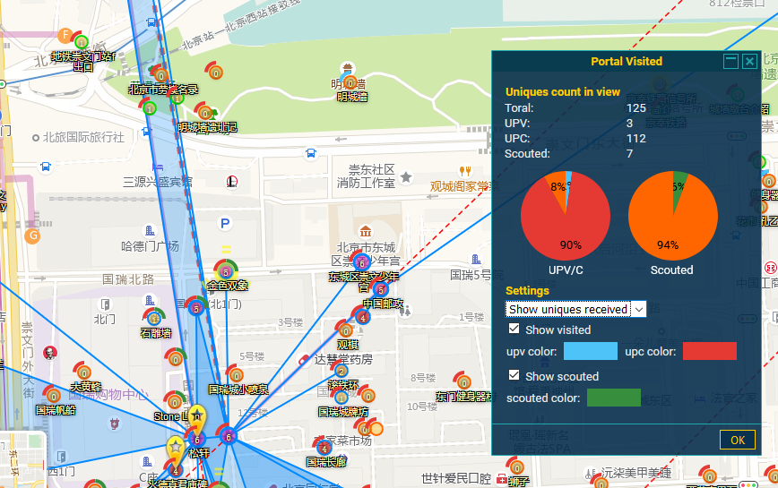
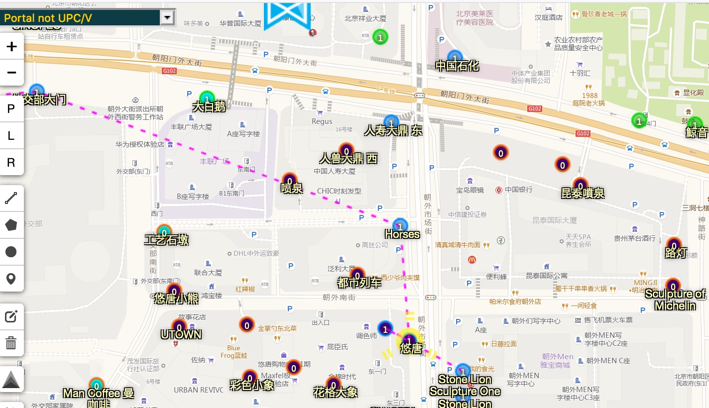
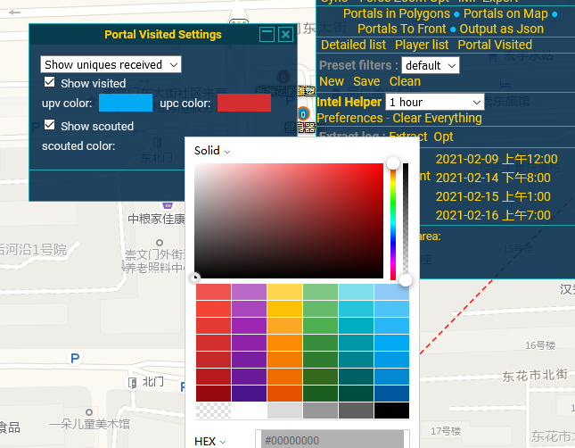

将portal的upc/upv和scout controler数据作为图层显示在intel地图上。 

增加了一个portal visited图层，根据设置以半圆弧的方式显示在po的上半圈
 

四个highlighter：Portal UPC/V、Portal Scouted、 not UPC/V、Portal not Scouted 
Portal UPC/V、Portal Scouted: 
 

可以通过右侧的portal visited打开配置框，选择图层中图示的显示方式以及颜色

