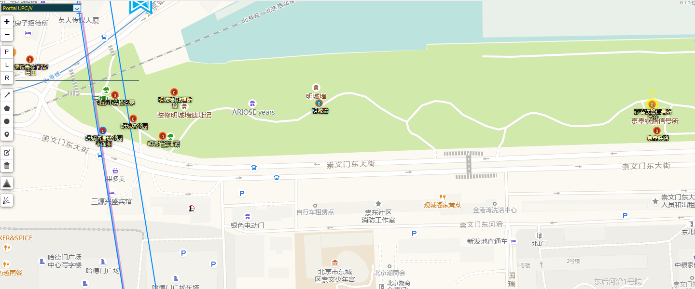

将portal的upc/upv和scope controler数据作为图层显示在intel地图上。 

包括四个图层：upc/v、scope controler、not upc/v、not scope controler 
upc/v、scope:
使用的nia官方的图片在po上套圈，红色upc 蓝色upv 橙色scope controler 
 
not upc/v、not scope controler:
红色圈为未upc/v过的、 红色圈为仅upv、红色圈为未扫过scope controler 

四个highlighter：Portal UPC/V、Portal Scoped、Portal not UPC/V、Portal not Scoped 
Portal UPC/V、Portal Scoped: 
深紫色upc、青色upv 黄色的scope controler 
 

Portal not UPC/V、Portal not Scoped： 
深紫色未upc/v、青色仅upv过、黄色的为未扫过scope controler 