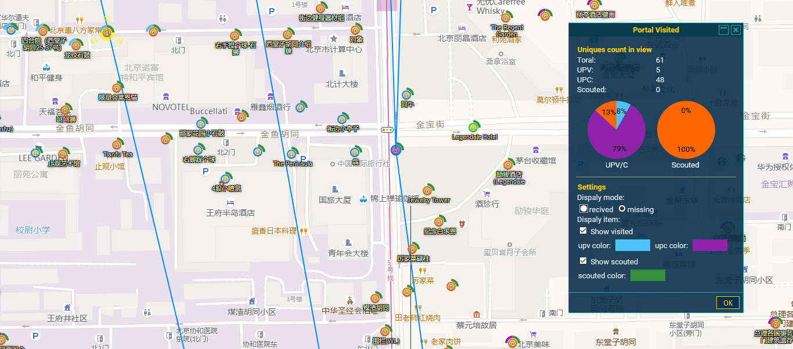

将portal的upc/upv和scope controler数据作为图层显示在intel地图上。 
包括两个图层：upc/v、scope controler 
使用的nia官方的图片在po上套圈，红色upc 蓝色upv 橙色scope controler 
 
两个highlighter：Portal UPC/V、Portal Scoped 
绿色upc、蓝色upv 黄色的scope controler 

